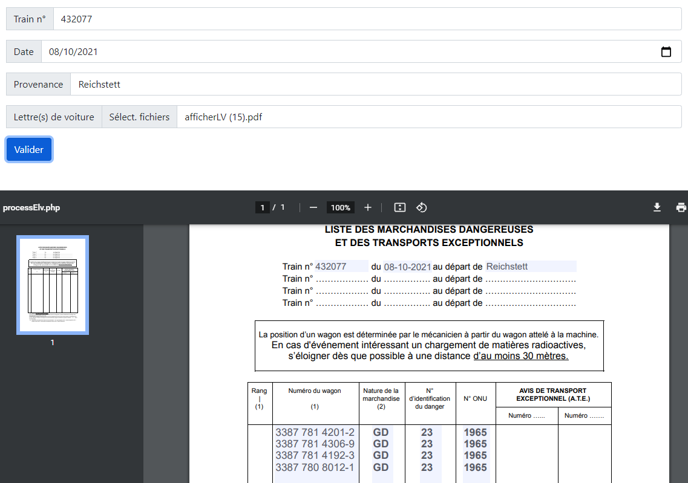

# ListeMD



## Objectifs

A partir d'un fichier PDF, extraire des données spécifiques grace à des Regex, puis recréer un PDF affichant ces données au format voulut pour utilisation.

## Installation

- Cloner le depot dans le dossier voulut
- Installer les dépendances via Composer
```
composer install
```

## Technologies utilisées

- Bootstrap
- PDF Parser (https://github.com/smalot/pdfparser)
- FPDM (https://github.com/codeshell/fpdm)
